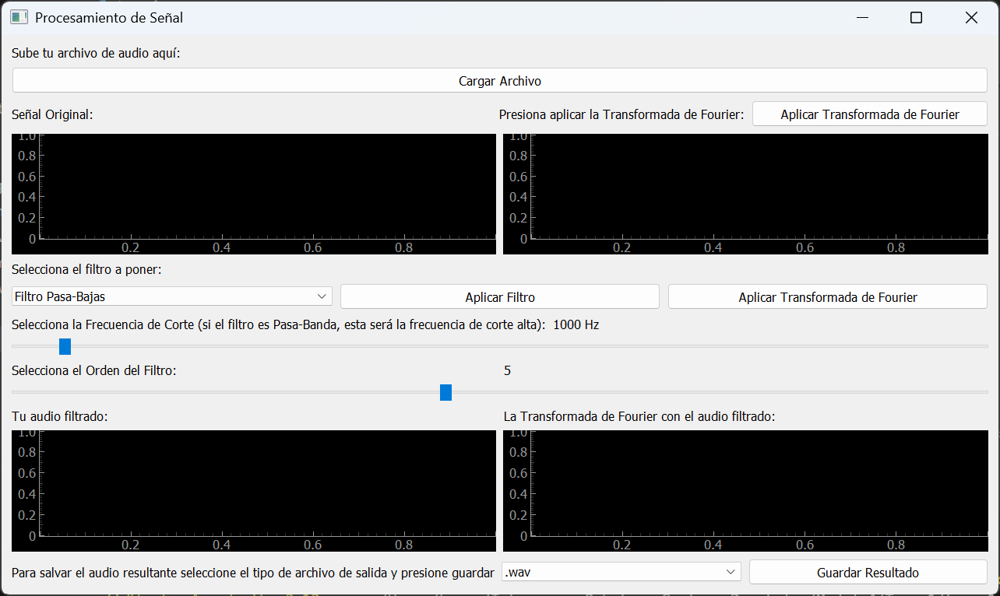
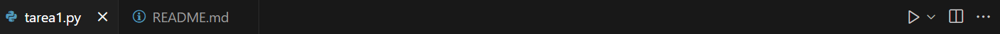
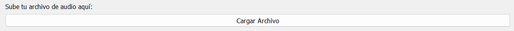
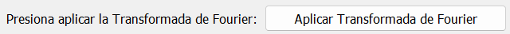
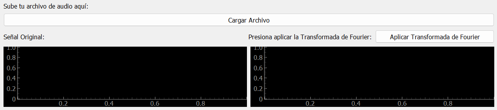
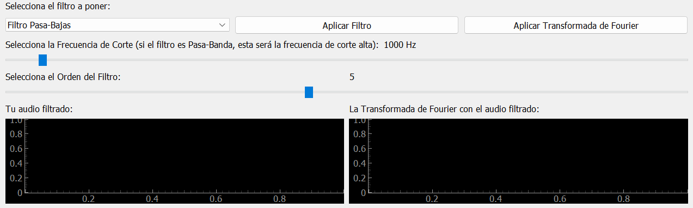
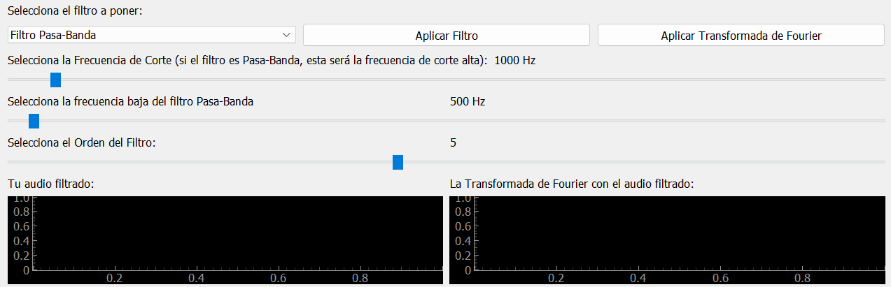
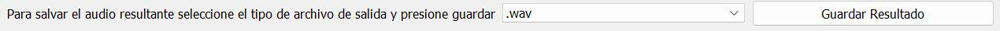

# Tarea 1. HMI for signal processing
## Karina Ruiz Tron 
## A01656073
## Profesor: Jesús Manuel Vázquez Nicolás

### Explicación general del código
Este código despliega una interfaz gráfica (HMI) en python que, al cargarle un archivo de audio, se puede graficar la señal procesada, aplicarle diferentes tipos de filtros, aplicarle la Transformada de Fourier y, finalmente, guardar el audio filtrado. 

### Paso 1 -> Instalación de librerías
Entre todas las librerías que se deben de importar, hay algunas que deben de instalarse en tu computadora, estas son:
* librosa
    * Librería para extraer audio
* numpy
    * Librería para realizar cálculos y manejar grandes volumenes de datos
* pyqtgraph
    * Librería para graficar señales
* soundfile
    * Librería para exportar señales
* SciPy
    * Librería para realizar los filtros
* pydub
    * Librería para generar archivo *.mp3*
* PyQt5
    * Librería de la interfaz

Escribe los siguientes comandos en la terminal de tu computadora:\
`pip install librosa`\
`pip install numpy`\
`pip install pyqtgraph`\
`pip install soundfile`\
`pip install scipy`\
`pip install pydub`\
`pip install pyqt5`

**Nota:** si no estas seguro de tener alguna de estas librerias intenta poner el siguiente comando en tu computadora, cambiando a *libreria* por la librería que quieras buscar:\
`libreria --version`

### Paso 2 -> Correr el código
Existen dos formas de correr el código:
1. Utilizando Visual Studio Code
Presiona en el botón de *Run* ubicado en la parte superior derecha (ve la foto de referencia).

2. Utilizando la terminal
Escribe el siguiente comando en tu computadora.\
**Nota:** Toma en cuenta que necesitas estar en la carpeta de tu codigo para poder ocuparla.\
**Nota 2:** Puede ser *python* o *python3* dependiendo de tu versión de python (puedes checar tu version ocupando el comando de version del apartado **Paso 1**).\
`python3 tarea1.py`

## Interfaz del código
* Cargar archivo
Presiona el botón de **Cargar Archivo** para subir tu archivo de audio *.wav* o *.mp3* (solo uno por vez) y espera a que este se procese y cargue la primera gráfica antes de continuar, de otra manera la ventana podría trabarse.\
**Nota:** puedes ocupar el archivo de audio guardado junto con este código o utilizar uno nuevo, solo recuerda que este debe ser *.wav* o *.mp3*.

* Aplica la **Transformada de Fourier**
Presiona el botón de **Aplicar Transformada de Fourier** si quieres que esta se aplique a tu señal original, no es obligatorio pero te ayudará a visualizar de mejor manera los cambios de tu señal original y tu señal filtrada.

#### Así es como se muestra esta primera parte de la interfaz

* Selecciona el filtro a utilizar y aplícalo
Presiona en el menú desplegable de los diferentes tipos de filtro y selecciona aquel que quieras aplicar, luego mueve los parámetros de *frecuencia de corte* y *orden de filtro* (estos tienen de valores inicales 1000 y 5 respectivamente) de acuerdo a lo que busques obtener.\
Si el filtro que seleccionaste es Pasa-Banda, se despliergará un nuevo parámetro que será la *frecuencia baja de corte* con un valor inicial de 500.\
Presiona el botón de **Aplicar Filtro** cuando estés seguro de los valores a utilizar.

* Aplica la **Transformada de Fourier** a la señal filtrada
Presiona el botón de **Aplicar Transformada de Fourier** si quieres que esta se aplique a tu señal filtrada (recuerda que esto puede ayudarte a ver los cambios en tus señales).

#### Así es como se muestra esta primera parte de la interfaz

#### Así es como se muestra esta primera parte de la interfaz con la selección de Filtro Pasa-Banda

* Selecciona el tipo de formato de salida y **guárdalo**
Para gardar tu audio filtrado presiona el menú desplegable y elige el formato de salida de tu señal (*.wav* o *.mp3*) y presiona el botón de **Guardar Resultado**. Podrás ver este archivo guardado en la misma carpeta que tu código con el nombre del filtro que hayas ocupado.

### Contacto
Si tienes cualquier duda sobre el funcionamiento del código que no haya sido explicada en este documento no dudes en contactarte por este medio.\
¡Gracias!

A01656073@tec.mx
