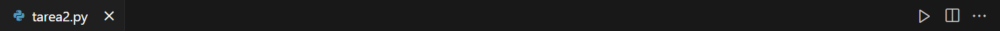

# Tarea 2. Kalman Filter Application
Karina Ruiz Tron/ 
A01656073/
Profesor: Jesús Manuel Vázquez Nicolás

## Explicación general del código
Este proyecto utiliza un filtro de Kalman para el seguimiento de objetos en un video. 

### Requisitos
- Python 3.x
- OpenCV
- NumPy

### Paso 1 -> Instalación de librerías 
Entre todas las librerías que se deben de importar, hay algunas que deben de instalarse en tu computadora, estas son:

* opencv
    * Librería de visión computacional
* numpy
    * Librería para realizar cálculos y manejar grandes volúmenes de datos

Puedes instalar las dependencias utilizando pip:

`pip install opencv`\
`pip install numpy`\

**Nota:** si no estás seguro de tener alguna de estas librerías intenta poner el siguiente comando en tu computadora, cambiando a *librería* por la librería que quieras buscar:\
`libreria --version`

### Paso 2 -> Correr el código
Existen dos formas de correr el código:
1. Utilizando Visual Studio Code
Presiona en el botón de *Run* ubicado en la parte superior derecha (ve la foto de referencia).

2. Utilizando la terminal
Escribe el siguiente comando en tu computadora.\
**Nota:** Toma en cuenta que necesitas estar en la carpeta de tu codigo para poder ocuparla.\
**Nota 2:** Puede ser *python* o *python3* dependiendo de tu versión de python (puedes checar tu versión ocupando el comando de versión del apartado **Paso 1**).\
`python3 tarea2.py`

### Inicialización del Filtro de Kalman
* Primero se configura el filtro de Kalman con 6 estados y 2 medidas.
* Se definen las matrices de medición, transición y covarianza del proceso.

### Procesamiento de Video
* Se abre el video a procesar y se le aplica a cada frame a escala de grises y se aplica un filtro gaussiano.
* Se detectan bordes utilizando Canny.
* Se encuentran los contornos en la imagen.

### Seguimiento de Objetos
* Se filtran los contornos por área mínima y máxima.
* Se utiliza el filtro de Kalman para predecir y corregir la posición de los objetos.
* Se dibujan los contornos y las predicciones en el frame original.

### Visualización
* Se muestran los frames procesados y los resultados en ventanas de OpenCV.

**Nota:** Puedes detener el código presionando la tecla *q*, puedes cambiarla por cualquier otra tecla dentro del código.\

### Contacto del Autor
Si tienes cualquier duda sobre el funcionamiento del código que no haya sido explicada en este documento no dudes en contactarte por este medio.\
¡Gracias!

A01656073@tec.mx
